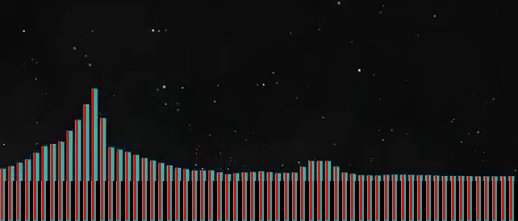

# audiolizer

**Note:** Requires OpenCV, probably &geq;2.4. Built on OpenCV 2.4.12 and Python 2.7, though the Python version shouldn't be very significant.
 

Mosntercat's v2.0 visualizer is quite the work of art (incidentally, overlaid on another work of art). Its minimalism also means no distracting backgrounds and plain colors, which is what makes this experiment possible. `audiolizer.py` takes a 360p MPEG video of a Monstercat v2.0 visualizer of any genre (except Electronic[a], Breaks &mdash; any genre colored white becuase it clashes too much with the particles) and tries to reconstruct the song from it.

##Usage

There are quite a few dependencies, so `virtualenv` is definitely recommended.

	(env)$ python audiolizer.py <path/to/video.mp4> <(float) start time in s> <output/raw_filename> [<(float) end time in s>]
	(env)$ python audiolizer.py dream_soda.mp4 2 output/dream_soda 220

This creates `dream_soda.wav` and, optionally, `dream_soda.mov`.

Without an end time, the program will process frames all the way to the end of the video, which is not wanted most of the time re: Monstercat end screen. The end screen usually takes up the last 20 seconds of the video.

##How it works

The color of the bars is approximated from the weighted average of a single frame spliced from the middle of the video. The frame is cropped to the region containing the bars, then each bar is extended by 40px below, to improve the accuracy of clustering. A tall 4px-wide image is spliced from the center of each bar and a two-cluster kmeans separates the bars and background. The height of the bar is found from the largest-area contiguous cluster within the set of clusters with the highest average saturation and value.

The frequency bins of the visualizer increase exponentially, and the parameters were estimated by ear and from comparing Fourier decompositions to the visualizer.

The output is assembled naively from a superposition of 62 sinusoids corresponding to the 62 bins in the frequency domain, then shoved uncompressed into a .wav at a 44.1kHz sampling rate. Optionally, the video showing clustering can be enabled by uncommenting lines 67 (`out_video = ...`), 118 and 119 (`bgr_frame = ...⏎out_video.write(...)`.

I find it runs about twice as slowly with video output enabled. Otherwise, it crunches ~4 FPS on a 2.9GHz i5 in a 2015 Macbook Pro.

##Upcoming

For now, the results are... unintelligible. The system has already been retuned with some improvement, but unless the output is very sensitive to tuning, the underlying reason is elsewhere. I blame the discreteness of the frequency domain, since intermediate frequencies don't exist. I think an inverse discrete-time Fourier transform is what I want instead, after interpolating in the frequency domain.

I've also noticed that mids are drowned out by the high frequencies. I tried to correct by the ISO 226:2003 equal-loudness contour, but the bass was amplified significantly with little change in the contrast between the mids and highs. Instead, I'm wondering if the assumption that the height of each bar is proportional to the contribution of that frequency might be incorrect. Instead, it might be a concave-up relationship, like a quadratic or an exponential. The underlying observation is that highs rarely peak.

_MIT-licensed_