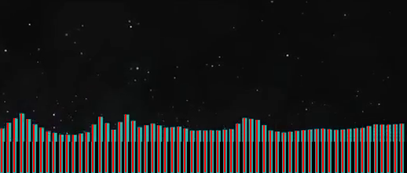

# audiolizer

**Note:** Requires OpenCV, probably &gte;2.4. Built on OpenCV 2.4.12 and Python 2.7, though the Python version shouldn't be very significant.
 

Mosntercat's v2.0 visualizer is quite the work of art (incidentally, overlain on another work of art). Its minimalism also means no distracting backgrounds and plain colors, which is what makes this experiment possible. `audiolizer.py` takes a 360p MPEG video of a Monstercat v2.0 visualizer of any genre (except Electronic[a], Breaks &mdash; any genre colored white becuase it clashes too much with the particles) and tries to reconstruct the song from it.

##Usage

There are quite a few dependencies, so `virtualenv` is definitely recommended.

	(env)$ python audiolizer.py <path/to/video.mp4> <(float) start time in s> <output/raw_filename> [<(float) end time in s>]
	(env)$ python audiolizer.py dream_soda.mp4 2 output/dream_soda 220

This creates `dream_soda.wav` and, optionally, `dream_soda.mov`.

Without an end time, the program will process frames all the way to the end of the video, which is not wanted most of the time re: Monstercat end screen. The end screen usually takes up the last 20 seconds of the video.

##How it works

The color of the bars is approximated from the weighted average of a single frame spliced from the middle of the video. The frame is cropped to the region containing the bars, then each bar is extended by 40px below, to improve the accuracy of clustering. A tall 4px-wide image is spliced from the center of each bar and a two-cluster kmeans separates the bars and background. The height of the bar is found from the largest-area contiguous cluster within the set of clusters with the highest average saturation and value.

The frequency bins of the visualizer increase exponentially, and the parameters were estimated by ear and from comparing Fourier decompositions to the visualizer output. 

Taking isolated tones like the Bb4 in "Do You Don't You" at 1:08.

The output is assembled naively from a superposition of 62 sinusoids corresponding to the 62 bins in the frequency domain, then shoved uncompressed into a .wav at a 44.1kHz sampling rate. Optionally, the video showing clustering can be enabled by uncommenting lines 67 (`out_video = ...`), 118 and 119 (`bgr_frame = ...⏎out_video.write(...)`.

I find it runs about twice as slowly with video output enabled. Otherwise, it crunches ~4 FPS on a 2.9GHz i5 in a 2015 Macbook Pro.

_MIT-licensed_